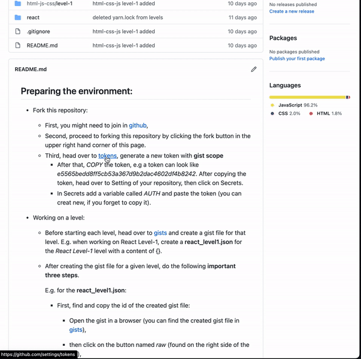
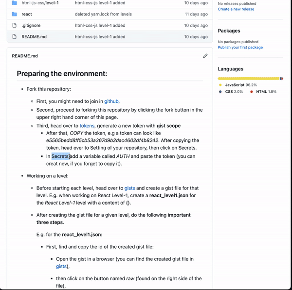
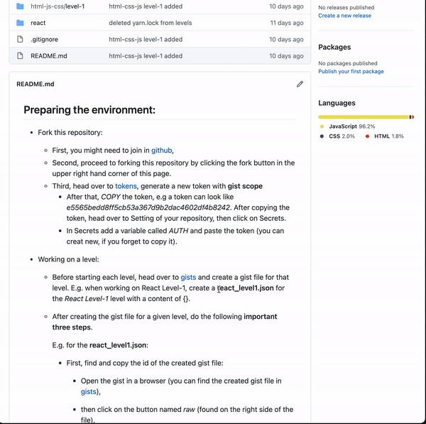
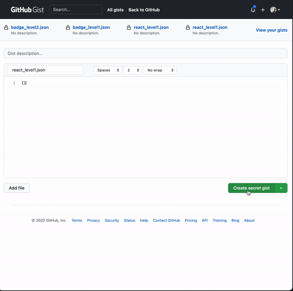
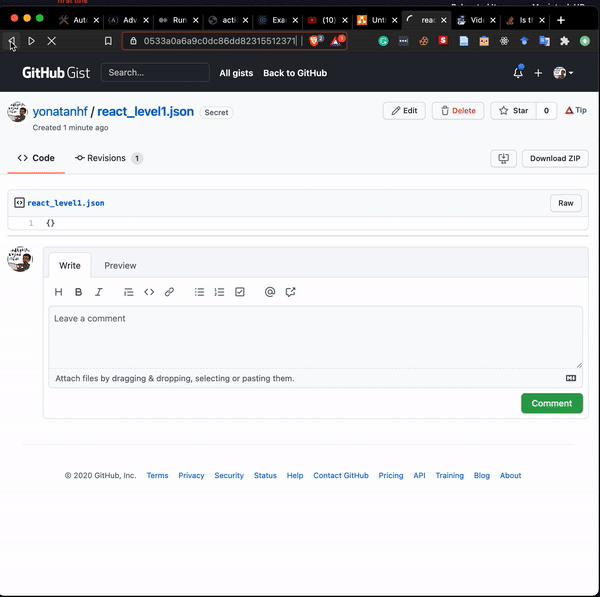

## Application-Development-Resource
This is a proposal for a step-by-step guideline to build web-applications. As part of a MSc. thesis work, this repository is open for suggestions, change proposals and feature updates.

## Overview
 The web-applications to be built are found in the folders, viz.: html-js-css, react and dhis2.

 
## Important
_Before starting on building, one need to prepare one's environment on Github._
### Preparing the environment: (_must be done before starting on building a web-application_)

The following two parts must be completed before starting to build the web-applications. After successful configuration by following Part I and Part II, you may proceed to build the web-apps.

- [Part I](#part-i): configuring your repository (one time setup) and
- [Part II](#part-ii): configuring before starting on one of the application to be done.

### Part I:

Fork this repository:

- First, you might need to join in [Github](https://github.com/join), because you will need the following features from Github: [Personal Access Tokens](https://docs.github.com/en/free-pro-team@latest/github/authenticating-to-github/creating-a-personal-access-token), [Github Secrets](https://docs.github.com/en/free-pro-team@latest/actions/reference/encrypted-secrets), and [Github Gists](https://docs.github.com/en/free-pro-team@latest/github/writing-on-github/creating-gists#about-gists).
- After Signing into your Github account, proceed to forking this repository by clicking the fork button in the upper right hand corner of this page. (can see here [about forking](https://www.youtube.com/watch?v=5oJHRbqEofs)), then you will only **be working on your forked repository**. 
    - Enable the workflow in the Actions section of your repository.
    - To start coding on your machine, you could clone your repository to your machine using:
  `git clone <your repository url>`
    - You might need [git](https://git-scm.com/downloads) and [nodejs](https://nodejs.org/en/download) installed on your machine.

- Third, head over to [tokens](https://github.com/settings/tokens), generate a new token with **gist scope**

  - After that, _COPY_ the token, e.g a token can look like _e5565bedd8ff5cb53a367d9b2dac4602df4b8242_.
    
  - After copying the token, head over to Setting of your repository, then click on Secrets.

    In Secrets add a variable called _AUTH_ and paste the token (you can create new, if you forget to copy it).

    

### Part II:

**This part is to be done for every application**.

- Now, before going to the application you want to work on, create a gist file for the application.

  **Naming should be based on names in the table name**.

  | Application    | html-js-css/level-1 | react/level-1     |     dhis2/level-1 |   dhis2/evel-2    |
  | -------------- | ------------------- | :---------------- | ----------------: | :---------------: |
  | Gist file name | html_level1.json    | react_level1.json | dhis2_level1.json | dhis2_level2.json |

  Example for the React Level-1:

  - You would head over to [gists](https://gist.github.com) and create a gist file for that application, called **react_level1.json** with a content of {}.
  - After creating the gist file for the application you are working on, do the following **important three steps**.

    

  - Find and copy the id of the created gist file:

    - Open the gist in a browser (you can find the created gist file in [gists](https://gist.github.com)),
    - then click on the button named _raw_ (found on the right side of the file),
    - then in your _browser url_ _COPY_ the id (everything after your github **username/** and before the **/raw**).
      **The gist id is different for different gists**

      In this sample url of a gist react_level1.json, we find the id is **67879aa1f153c6b783303f177fdbaf73** from the url *https://gist.githubusercontent.com/yonatanhf/67879aa1f153c6b783303f177fdbaf73/raw/920af8d64ec652ddabc3ff8feb6d0354a0a71173/react_level1.json*.

      

  - Now, head over to secrets of your repository and create a new repository secret to hold the id of the gist file.

    **Naming should be as names in the table name**.

    | Application    | html-js-css/level-1 | react/level-1     |     dhis2/level-1 |   dhis2/evel-2    |
    | -------------- | ------------------- | :---------------- | ----------------: | :---------------: |
    | Gist file name | html_level1.json    | react_level1.json | dhis2_level1.json | dhis2_level2.json |
    | Secret name    | HTML_LEVEL1         | REACT_LEVEL1      |      DHIS2_LEVEL1 |   DHIS2_LEVEL2    |

  - E.g. While working on the React Level1, call the secret as _REACT_LEVEL1_ and give it the id of the gist _react_level1.json_

    In this sample example, the id is **67879aa1f153c6b783303f177fdbaf73**. See below for more.

    

  - Third and important, edit this readme file, so as to display the badge of the completed application you worked on.
    - Just under the **Applications' completion status** part in this page below where the badges are displayed, edit the the url of the badges.
      - E.g. Use the same copied id and paste it inside the url of the badge level-1, that is to replace the **pastecopiedidof-react-level-1** part of the url with the copied id. The url looks like: https://gist.githubusercontent.com/your-username/pastecopiedidof-react-level-1/raw/react_level1.json
      - Similarly, replace the **your-username** part of the url by your Github username.

- Remember to do the same **three steps** for every level you are working on. E.g.: if started React level-2, then create a [gist](https://gist.github.com) file called **react_level2.json**, then define a secret called _REACT_LEVEL2_. The content of the secret is id of the react_level-2.json (found in the url). At last, paste the same id in to the **pastecopiedidof-reactlevel-2** at the level-2 badge below.

## Time to build a web-application:

- At last, to get started with a level, go to the directory of the level and read the readme of that level and follow those steps for that level.

## Applications' completion status

##### HTML-CSS-JS

level-1: 

##### React:

level-1: 

##### DHIS2:

Level-1: 

level-2: 

